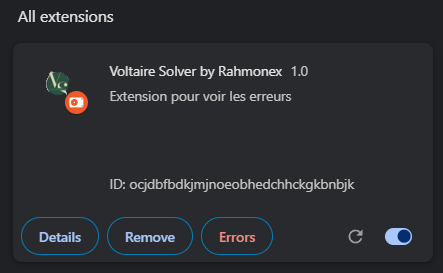

# Voltaire-Solver-Extension

**Voltaire Solver by Rahmonex** is a robust web extension tailored to enrich your French language journey on GitHub. Inspired by the legacy of the esteemed French writer and philosopher, Voltaire, this tool empowers users to refine their written expression with unparalleled accuracy and clarity.

⚠️ **Please Note:** This extension is not perfect and might not resolve all errors. It is recommended to use it as a tool to assist in error detection and correction, but human proofreading is still advised for comprehensive language refinement.

## How to Use:

1. First, clone the repository:
```bash
git clone "https://github.com/RahmonexTheOne/Voltaire-Solver-Extension.git"
```

2. Open Google Chrome and navigate to: `chrome://extensions/`.

3. Enable developer mode.<br>


5. Click on "Load unpacked" and select the directory of the cloned GitHub repository.<br>


6. You should now see the Voltaire Solver extension listed among your Chrome extensions.<br>


## What does the script do:

### Content Script (`content-script.js`):

- This script seamlessly integrates into web pages, facilitating interactions with their content.
- It incorporates a `debounce` function, strategically delaying the execution of actions to prevent overwhelming the LanguageTool API with excessive requests.
- The `displayCorrection` function visually annotates errors within text by intelligently inserting "(faute ici)" (error here) at the precise locations.
- Utilizing the `checkAndDisplayCorrections` function, text content undergoes meticulous scrutiny via the LanguageTool API, with detected errors promptly marked for review.
- Employing a MutationObserver, the script dynamically monitors DOM changes, particularly the addition of new sentence elements, to initiate error-checking procedures.

### Manifest (`manifest.json`):

- Metadata and permissions are meticulously defined to ensure seamless functionality of the extension.
- Permissions are granted for accessing active tabs and communicating with the LanguageTool API.
- A background script (`background.js`) is designated to handle browser action events.
- Content scripts are configured to operate across all URLs, encompassing `content-script.js`.
- Diverse icon sizes are provided to enhance visual representation.

### Background Script (`background.js`):

- This script attentively listens for user interactions, specifically clicks on the extension's icon.
- Upon detection of user action, it orchestrates the execution of the content script (`content-script.js`) within the active tab, facilitating error detection and correction.

Embark on your journey of linguistic refinement with **Voltaire Solver by Rahmonex** — your indispensable companion for elevating French language proficiency on GitHub.
